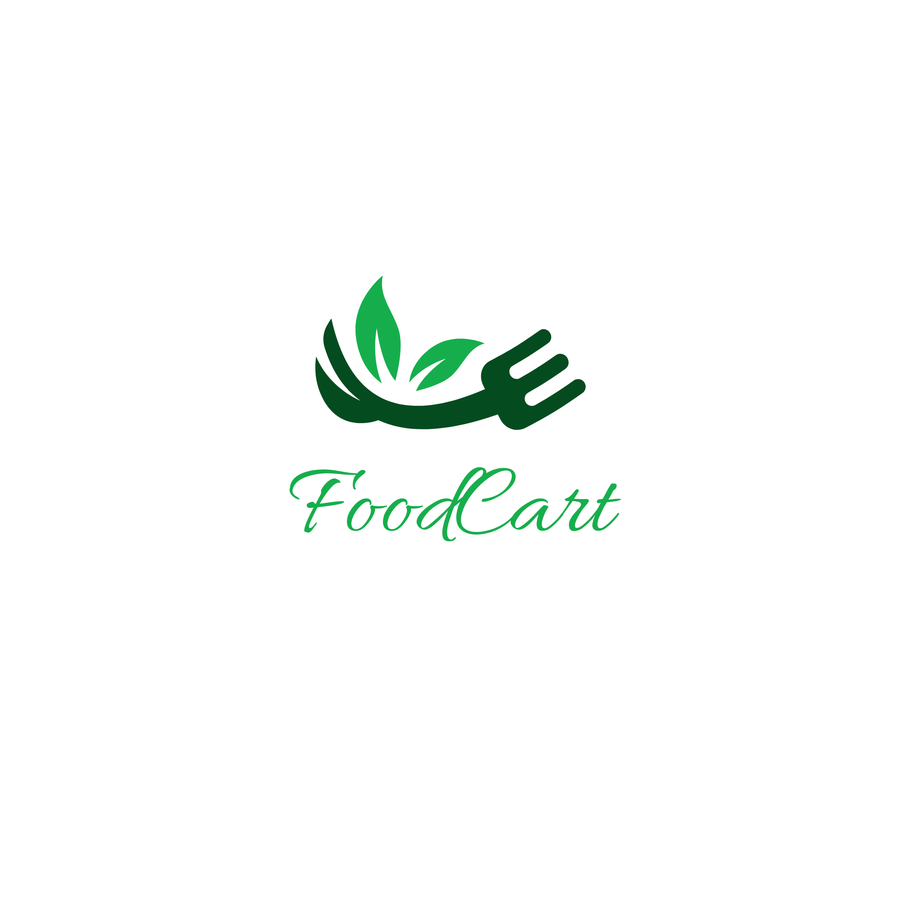

# Food Cart - Modern Food Ordering Platform

A modern, full-stack food ordering platform built with Next.js 14, featuring a beautiful UI, authentication, dashboard, and real-time order management.



## 🌟 Features

- **Modern UI/UX**: Clean and responsive design with Tailwind CSS
- **Authentication**: NextAuth.js with Google and credentials login
- **Dashboard**: Interactive admin dashboard with charts and analytics
- **Dynamic Menu**: Regular and popular dishes with real-time updates
- **Order Management**: Cart functionality and order tracking
- **Responsive Design**: Mobile-first approach for all screen sizes
- **MongoDB Integration**: Robust database management
- **Real-time Charts**: Using Recharts for data visualization

## 🚀 Tech Stack

- **Frontend**: Next.js 14, React, Tailwind CSS
- **Backend**: Next.js API Routes
- **Database**: MongoDB
- **Authentication**: NextAuth.js
- **Charts**: Recharts
- **Deployment**: Vercel
- **Icons**: React Icons

## 📥 Installation & Setup

1. **Clone the repository**
   ```bash
   git clone https://github.com/Bokul98/food-cart-v2.git
   cd food-cart-v2
   ```

2. **Install dependencies**
   ```bash
   npm install
   ```

3. **Environment Variables**
   Create a `.env.local` file in the root directory:
   ```env
   NEXTAUTH_SECRET=your-secret-key
   NEXTAUTH_URL=http://localhost:3000
   GOOGLE_CLIENT_ID=your-google-client-id
   GOOGLE_CLIENT_SECRET=your-google-client-secret
   MONGODB_URI=your-mongodb-uri
   ```

4. **Run the development server**
   ```bash
   npm run dev
   ```

5. **Open [http://localhost:3000](http://localhost:3000) in your browser**

## 🗺️ Route Structure

### Public Routes
- `/` - Home page with featured dishes
- `/login` - User login page
- `/register` - User registration page
- `/all-products` - All available menu items
- `/all-products/[id]` - Individual product details
- `/about` - About page
- `/menu` - Menu page

### Protected Routes
- `/dashboard` - Admin dashboard
- `/dashboard/add-food` - Add new food items
- `/dashboard/orders` - Order management

### API Routes
- `/api/auth/*` - Authentication endpoints
- `/api/menu` - Menu management
- `/api/register` - User registration
- `/api/orders` - Order management

## 🛠️ Development

### File Structure
```
src/
├── app/
│   ├── (auth)/
│   │   ├── login/
│   │   └── register/
│   ├── (private)/
│   │   └── dashboard/
│   └── (public)/
│       ├── about/
│       ├── all-products/
│       └── menu/
├── components/
├── lib/
└── middleware.js
```

### Key Components
- **AuthProvider**: Handles authentication state
- **Dashboard**: Admin controls and analytics
- **RegularDish**: Dynamic menu display
- **AddFoodForm**: Food item management
- **UserNav**: Navigation based on auth state

## 📱 Responsive Design

- Mobile-first approach
- Breakpoints:
  - Mobile: < 640px
  - Tablet: 640px - 1024px
  - Desktop: > 1024px

## 🚀 Deployment

This project is deployed on Vercel. For deployment:

1. Push your code to GitHub
2. Connect your repository to Vercel
3. Configure environment variables in Vercel
4. Deploy!

## 🤝 Contributing

Contributions are welcome! Please feel free to submit a Pull Request.

## 📝 License

This project is licensed under the MIT License - see the [LICENSE](LICENSE) file for details.
